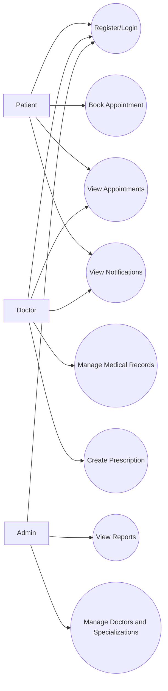
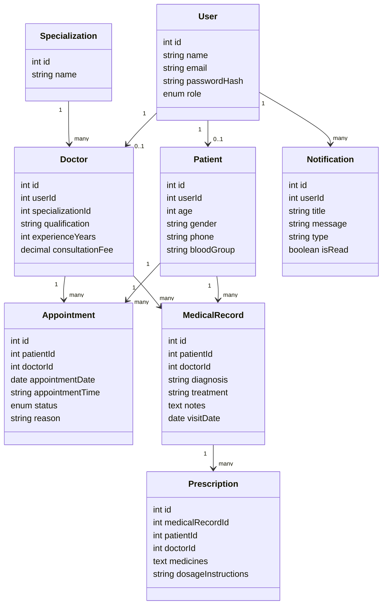
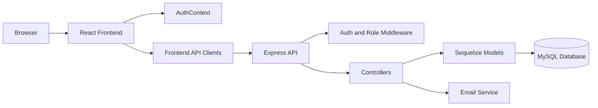
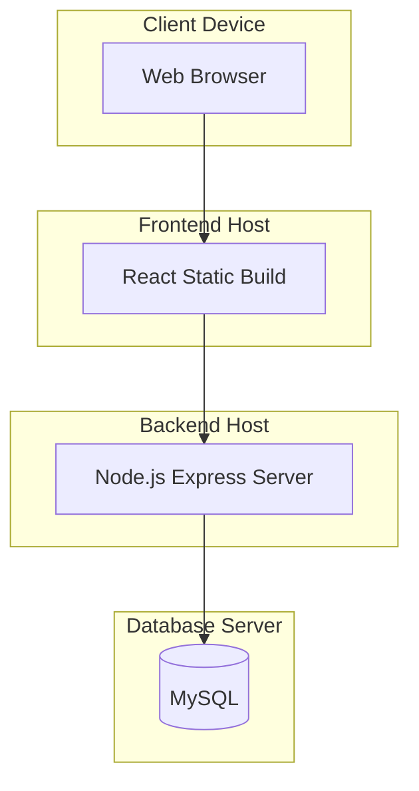
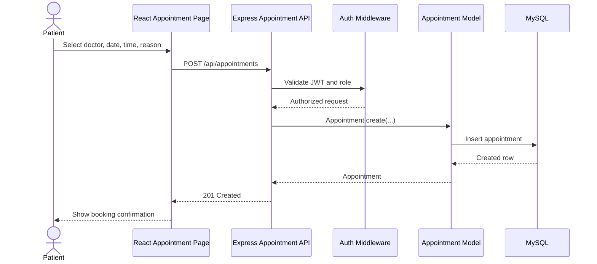
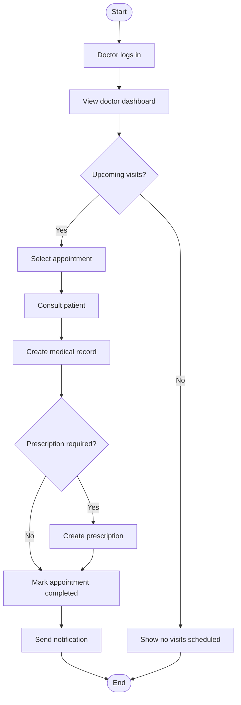
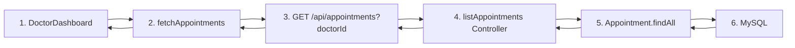

# Software Engineering Syllabus Alignment

Project: Smart Hospital Appointment and Record Management System

This document maps the project to the Software Engineering syllabus units. The project is a role-based full-stack healthcare system with a React frontend, Express API, Sequelize models, MySQL persistence, JWT authentication, appointments, records, prescriptions, notifications, reports, and automated backend tests.

## Unit I: Software Engineering Paradigms

### Best-Fit Process Model

The project fits an Incremental + Rapid Application Development + Evolutionary model.

| Process model | Fit for this project | Project evidence |
| --- | --- | --- |
| Code-and-Fix | Not recommended as the primary model because the system handles medical appointments, records, and user roles. It still appears in small UI fixes or low-risk polishing. | Component-level changes such as dashboard text, cards, and layout tweaks can be handled quickly. |
| Waterfall | Useful for initial documentation, scope, and architecture, but too rigid for dashboard and workflow changes. | README, API documentation, model definitions, and route structure establish baseline design. |
| RAD | Strong fit because the frontend dashboards and appointment forms can be prototyped quickly with mock data, then connected to APIs. | `frontend/src/data/mockData.js`, React pages, reusable cards and forms. |
| Incremental | Strongest fit because the project can be delivered feature by feature. | Auth, appointments, records, prescriptions, notifications, and reports are separable increments. |
| Evolutionary | Strong fit because healthcare workflows need feedback from patients, doctors, and admins. | Mock-data fallback and API-backed dashboards support gradual improvement. |

### Increment Plan

| Increment | Features | Acceptance focus |
| --- | --- | --- |
| Increment 1 | Authentication, registration, login, protected routes | Users can log in with role-based access. |
| Increment 2 | Doctor search and appointment booking | Patients can book appointments with doctors. |
| Increment 3 | Doctor dashboard and appointment lifecycle | Doctors can view visits and update appointment status. |
| Increment 4 | Medical records and prescriptions | Doctors can create records and prescriptions; patients can view them. |
| Increment 5 | Notifications and reports | Users receive reminders; admins view operational summaries. |

## Unit II: Requirements Engineering

### Stakeholders

| Stakeholder | Goal |
| --- | --- |
| Patient | Register, book appointments, view records and notifications. |
| Doctor | View appointments, manage visit notes, create records and prescriptions. |
| Admin | Monitor usage, appointment counts, doctors, patients, and reports. |
| Hospital staff | Reduce manual scheduling work and improve record availability. |

### Requirement Elicitation Techniques

| Technique | How it fits this project |
| --- | --- |
| Interviews | Ask doctors and front-desk staff about booking, cancellation, and visit-note workflows. |
| Questionnaires | Collect patient expectations for appointment reminders and record visibility. |
| Observation | Study manual hospital scheduling and patient check-in flow. |
| Document analysis | Review existing appointment registers, prescription formats, and patient record templates. |
| Prototyping | Use React dashboards and mock data to validate workflows before final API integration. |

### System Scope

In scope:

- User registration and login for patient, doctor, and admin roles.
- Role-based dashboards.
- Doctor listing by specialization.
- Appointment booking, listing, rescheduling, cancellation, and completion status.
- Medical records and prescriptions.
- Notifications.
- Admin summary reports.

Out of scope for the current version:

- Payment gateway integration.
- Video consultation.
- Lab integration.
- Insurance claim processing.
- Full hospital ERP inventory and billing.

### Feasibility Study

| Feasibility type | Assessment |
| --- | --- |
| Technical | Feasible with React, Express, Sequelize, MySQL, JWT, and REST APIs already present in the repo. |
| Operational | Feasible because the workflows match common patient, doctor, and admin tasks. |
| Economic | Feasible for an academic project because it uses open-source tools. |
| Schedule | Feasible through incremental delivery over four sprints. |
| Legal and ethical | Requires privacy-aware handling of medical data, authentication, authorization, and restricted record access. |

### Functional Requirements

| ID | Requirement | Current project location |
| --- | --- | --- |
| FR-01 | The system shall allow users to register as patient, doctor, or admin. | `backend/src/controllers/authController.js`, `frontend/src/pages/RegisterPage.jsx` |
| FR-02 | The system shall authenticate users and issue JWT tokens. | `backend/src/controllers/authController.js`, `backend/src/utils/jwt.js` |
| FR-03 | The system shall protect routes based on user role. | `backend/src/middleware/auth.js`, `frontend/src/components/ProtectedRoute.jsx` |
| FR-04 | Patients shall be able to view doctors and book appointments. | `frontend/src/pages/AppointmentPage.jsx`, `backend/src/controllers/appointmentController.js` |
| FR-05 | Doctors shall be able to view appointments assigned to them. | `frontend/src/pages/DoctorDashboard.jsx`, `backend/src/controllers/appointmentController.js` |
| FR-06 | Doctors shall be able to create and view medical records. | `frontend/src/pages/MedicalRecordsPage.jsx`, `backend/src/controllers/recordController.js` |
| FR-07 | The system shall support prescriptions linked to medical records. | `backend/src/controllers/prescriptionController.js`, `backend/src/models/Prescription.js` |
| FR-08 | Users shall receive system notifications. | `backend/src/controllers/notificationController.js`, `backend/src/models/Notification.js` |
| FR-09 | Admins shall view summary reports. | `frontend/src/pages/AdminDashboard.jsx`, `backend/src/controllers/reportController.js` |

### Non-Functional Requirements

| Category | Requirement |
| --- | --- |
| Security | Passwords must be hashed with bcrypt; APIs must use JWT auth and role guards. |
| Privacy | Patients should only access their own records unless the role permits broader access. |
| Reliability | API failures should not break the frontend; current dashboards use mock-data fallback. |
| Usability | Dashboards should show high-priority tasks such as upcoming visits and recent records first. |
| Maintainability | Frontend pages, API clients, backend controllers, routes, and models should remain separated. |
| Performance | Database indexes should support common appointment and record filters. |
| Testability | Route-level backend behavior should be covered with Jest and Supertest. |

### Domain Requirements

- Every appointment must have one patient, one doctor, a date, a time, and a status.
- Appointment status is limited to `booked`, `completed`, or `cancelled`.
- A doctor belongs to a specialization.
- A medical record belongs to one patient and one doctor.
- A prescription belongs to a medical record.
- A user role is limited to `patient`, `doctor`, or `admin`.

### Ambiguity and Conflict Handling

| Issue | Ambiguity or conflict | Resolution |
| --- | --- | --- |
| "Today appointments" | Could mean all booked appointments or appointments on the current date. | Define it as appointments where `appointmentDate` equals the local current date and status is `booked`. |
| Record access | Patient privacy conflicts with admin/doctor visibility. | Apply role guards and query filters by patientId or doctorId. |
| Appointment status | "Cancelled" and "completed" should not be editable in the same way as booked appointments. | Define allowed status transitions in acceptance criteria. |
| Doctor registration | Doctor specialization may be entered as id or name. | Backend already supports id lookup, name creation, and fallback specialization. |

### Requirement Quality Checklist

Good requirements in this project should be:

- Clear: one behavior per requirement.
- Complete: includes actor, action, data, and expected result.
- Feasible: implementable using the current stack.
- Testable: can be verified by UI flow, API test, or database assertion.
- Traceable: mapped to frontend page, backend controller, model, or test.
- Unambiguous: uses exact field names such as `doctorId`, `patientId`, and `status`.

## Unit III: Agile Methodology

### Scrum Roles

| Scrum role | Project mapping |
| --- | --- |
| Product Owner | Hospital representative or project guide defining patient, doctor, and admin priorities. |
| Scrum Master | Team member ensuring sprint planning, standups, blockers, and review discipline. |
| Development Team | Frontend, backend, database, testing, and documentation contributors. |
| Managers | Academic mentor or evaluation team reviewing scope and progress. |

### Product Backlog

| Priority | Backlog item | User story |
| --- | --- | --- |
| P1 | Authentication | As a user, I want secure login so that my dashboard and records are protected. |
| P1 | Appointment booking | As a patient, I want to book a doctor appointment so that I can reserve a visit slot. |
| P1 | Doctor dashboard | As a doctor, I want to see my upcoming visits so that I can plan consultations. |
| P2 | Medical records | As a doctor, I want to add visit notes so that patient history is available later. |
| P2 | Prescriptions | As a doctor, I want to attach prescriptions to records so that treatment instructions are stored. |
| P2 | Notifications | As a user, I want appointment reminders so that I do not miss visits. |
| P3 | Reports | As an admin, I want summary analytics so that hospital activity can be monitored. |

### Sprint Plan

| Sprint | Goal | Deliverables |
| --- | --- | --- |
| Sprint 1 | Core setup and authentication | React shell, Express app, Sequelize models, JWT login/register, protected routes. |
| Sprint 2 | Appointment workflow | Doctor listing, booking API, appointment listing, update status, patient dashboard. |
| Sprint 3 | Clinical record workflow | Medical record pages, record APIs, prescription APIs, doctor dashboard updates. |
| Sprint 4 | Notifications, reporting, and testing | Notification APIs, admin reports, seed data, Jest/Supertest coverage, docs. |

### Agile Principles Applied

- Deliver working software incrementally through role-based dashboards and REST APIs.
- Welcome change by keeping frontend API modules, pages, controllers, and models loosely coupled.
- Collaborate with stakeholders through prototypes and sprint reviews.
- Keep the design simple by using layered architecture and reusable UI components.
- Verify behavior continuously with backend tests.

## Unit IV: Static and Dynamic Interaction Modeling

### Use Case Diagram

### Class Diagram

### Component Diagram

### Deployment Diagram

### Sequence Diagram: Book Appointment

### Activity Diagram: Doctor Visit Workflow

### Communication Diagram: Appointment Listing

### Collaboration Diagram: Record Creation

```mermaid
flowchart LR
  Doctor[Doctor]
  RecordsPage[MedicalRecordsPage]
  RecordsApi[records.js API Client]
  Route[recordRoutes.js]
  Controller[recordController.js]
  Model[MedicalRecord Model]
  DB[(MySQL)]

  Doctor -- "1. Submit diagnosis and notes" --> RecordsPage
  RecordsPage -- "2. createRecord(payload)" --> RecordsApi
  RecordsApi -- "3. POST /records" --> Route
  Route -- "4. authGuard + roleGuard" --> Controller
  Controller -- "5. MedicalRecord.create" --> Model
  Model -- "6. INSERT" --> DB
```

## Unit V: Software Architecture Design

### Architecture Style

The system uses a layered client-server MVC-style architecture.

| Layer | Responsibility | Project files |
| --- | --- | --- |
| View | React pages and reusable UI components. | `frontend/src/pages`, `frontend/src/components` |
| Client state and routing | Auth context, protected routes, browser navigation. | `frontend/src/state/AuthContext.jsx`, `frontend/src/App.jsx` |
| API client | HTTP communication with backend. | `frontend/src/api` |
| Controller | Request handling and response shaping. | `backend/src/controllers` |
| Middleware | Authentication, authorization, parsing, CORS. | `backend/src/middleware`, `backend/src/app.js` |
| Model | Domain entities and associations. | `backend/src/models` |
| Persistence | Relational storage. | MySQL through Sequelize |

### Software Architecture vs Software Design

| Topic | In this project |
| --- | --- |
| Architecture | Decides the system structure: React client, Express server, REST APIs, MySQL database, layered backend. |
| Design | Decides internal module behavior: components, controllers, model associations, API clients, validation, and status transitions. |

### Design Qualities

| Quality | Current support |
| --- | --- |
| Modularity | Routes, controllers, models, and UI components are separated. |
| Reusability | Cards, layout, protected route, API client, and auth context are reused. |
| Maintainability | Each domain area has separate route/controller/model files. |
| Security | JWT, bcrypt, and role guards are present. |
| Scalability | REST endpoints and database indexes support extension. |
| Testability | Backend tests cover auth and appointment behavior. |

### Cohesion and Coupling

- High cohesion: `appointmentController.js` focuses on appointment use cases; `DoctorDashboard.jsx` focuses on doctor-facing view composition.
- Low coupling: frontend uses API modules instead of calling Axios directly from every component.
- Acceptable coupling: Sequelize associations connect models where the domain requires relationships.
- Improvement point: add stricter service-layer validation for appointment slot conflicts and record access policies.

### Design Principles and Heuristics

- Separate concerns between UI, API client, controller, model, and database.
- Keep role checks close to protected routes and middleware.
- Prefer reusable UI components over repeated dashboard markup.
- Validate required fields on the server.
- Keep database associations explicit.
- Use indexes for common appointment and record queries.
- Keep mock data available only as a frontend resilience fallback, not as source of truth.

### Reuse

| Reusable element | Reuse purpose |
| --- | --- |
| `DashboardLayout` | Common dashboard shell for patient, doctor, and admin views. |
| `SectionCard`, `StatCard`, `AppointmentCard`, `RecordCard` | Reusable information display patterns. |
| `api/client.js` | Central Axios configuration and auth token management. |
| `authGuard` and `roleGuard` | Reusable backend security middleware. |
| Sequelize models | Shared persistence layer for controllers and tests. |

## Unit VI: Design Patterns

### Patterns Already Represented

| Pattern | Type | Project mapping |
| --- | --- | --- |
| MVC | Architectural | React pages are views, Express controllers handle request logic, Sequelize models represent data. |
| Facade | Structural | Frontend API modules such as `appointments.js`, `records.js`, and `auth.js` hide Axios request details from pages. |
| Adapter | Structural | `frontend/src/api/client.js` adapts Axios to the app's API configuration and token storage needs. |
| Chain of Responsibility | Behavioral | Express middleware chain passes requests through CORS, JSON parsing, auth guards, role guards, and controllers. |
| Factory Method | Creational | Sequelize model methods such as `Model.create` and `findOrCreate` centralize object creation from request data. |

### Patterns That Can Be Added for Stronger Syllabus Coverage

| Pattern | Where to apply | Example use |
| --- | --- | --- |
| Abstract Factory | Notification delivery | Create `EmailNotificationFactory` and `SmsNotificationFactory` for different notification channels. |
| Builder | Report filters | Build complex report query options from optional `from`, `to`, `status`, and specialization filters. |
| Prototype | Appointment templates | Clone a recurring appointment template for follow-up visits. |
| Bridge | Notification service | Separate notification abstraction from email, SMS, or in-app implementations. |
| Composite | Dashboard widgets | Treat single widgets and grouped widgets uniformly in admin dashboard configuration. |
| Decorator | API logging or response formatting | Wrap controller handlers with logging, timing, or error formatting behavior. |
| Command | Appointment actions | Represent book, cancel, reschedule, and complete actions as command objects. |
| Interpreter | Search filters | Parse simple record search expressions into Sequelize query filters. |

## Traceability Matrix

| Syllabus unit | Project artifact |
| --- | --- |
| Unit I: Process models | Increment plan, sprint delivery in README, modular feature delivery. |
| Unit II: Requirements engineering | Functional/non-functional/domain requirements in this document and API surface in `docs/api.md`. |
| Unit III: Agile methodology | Product backlog, user stories, sprint plan, Scrum roles. |
| Unit IV: Modeling | Use case, class, component, deployment, sequence, activity, communication, and collaboration diagrams. |
| Unit V: Architecture design | Layered MVC client-server architecture with React, Express, Sequelize, and MySQL. |
| Unit VI: Design patterns | Facade, adapter, chain of responsibility, factory method, and proposed extensions. |

## Suggested Viva Points

- The project is not just a CRUD app; it has role-based access, domain relationships, appointment lifecycle, medical records, notifications, and reports.
- Incremental development is the best process model because each healthcare workflow can be delivered and tested independently.
- Requirements are traceable from stakeholder goals to React pages, API routes, controllers, Sequelize models, and tests.
- Static modeling is represented by use case, class, component, and deployment diagrams.
- Dynamic modeling is represented by appointment booking, doctor visit, appointment listing, and record creation interactions.
- The architecture is layered and client-server, with MVC-style separation on the backend.
- Design patterns are present through middleware chains, API facades, Axios adaptation, and Sequelize creation methods.
